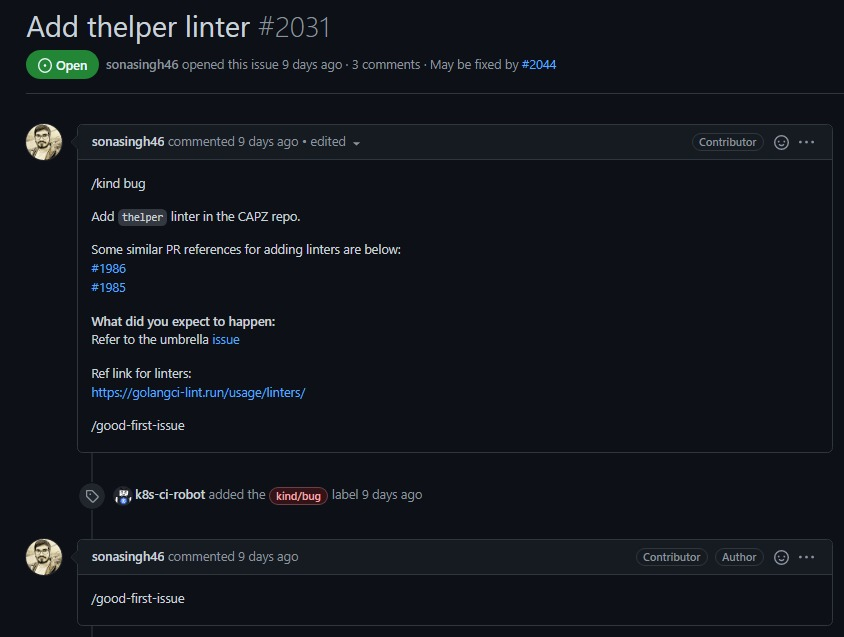
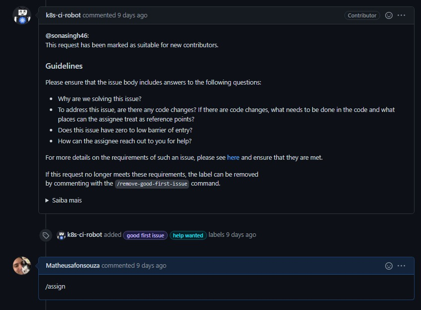
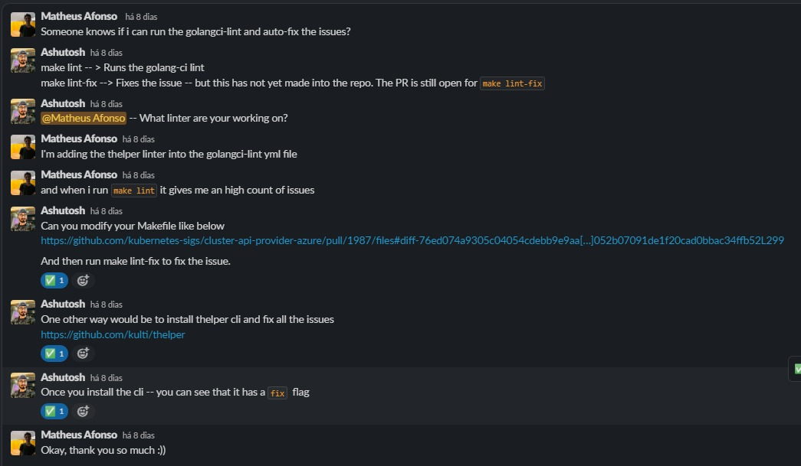
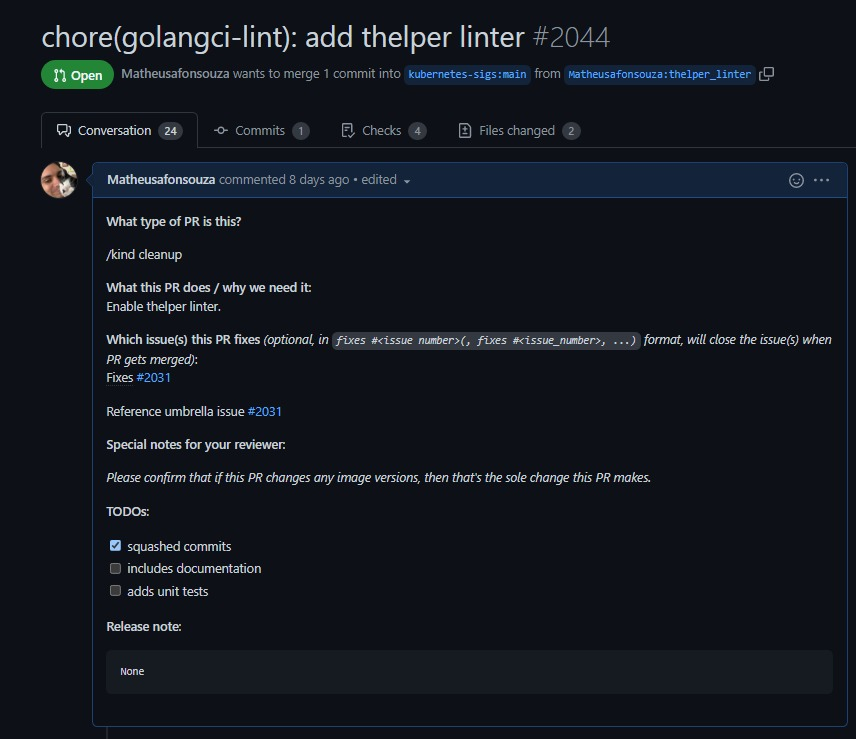
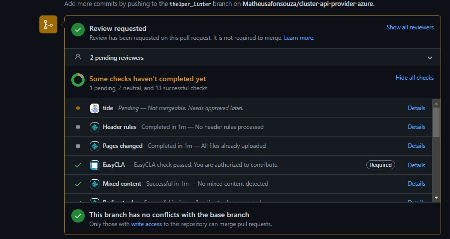

# Issue [#2031 thelper azure](https://github.com/kubernetes-sigs/cluster-api-provider-azure/issues/2031)

A issue escolhida para execução foi uma issue ligada à padronização da qualidade do código através de linters, onde o mesmo realiza a validação e levantamento de erros relacionados à falta da qualidade do código. Assim, através dessa issue foi implementado o linter Thelper dentro do repositório Cluster Api Provider Azure da organização.

|Página|Status|Responsável|
|:--:|:--:|:--:|
|Cluster Api Provider Azure|[PR em revisão](https://github.com/kubernetes-sigs/cluster-api-provider-azure/pull/2044)|Matheus Afonso|

## Prints

### Issue

Issue criada e conversas dentro da thread.

### Pull Request

Pull request aberto para análise.

## Histórico de Revisão
|Data|Versão|Descrição|Autor|
|:--:|:--:|:--:|:--:|
|10/02/22|0.1|Criação do documento|Matheus Afonso|
|10/02/22|0.2|Adição de prints|Matheus Afonso|