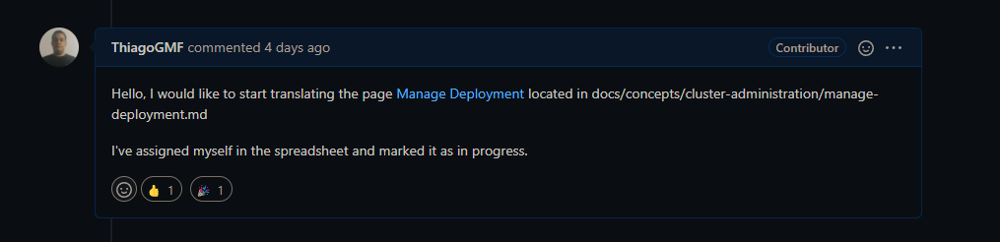

# Issue [#13939 Tracking Portuguese Translation Progress (M1)](https://github.com/kubernetes/website/issues/13939)

A issue 13939 é uma issue voltada para o rastreamento da tradução das páginas que envolvem a documentação referente ao kubernetes para português. A issue foi escolhida devido à importância de ter os documentos relacionados as funcionalidades do kubernetes em outros idiomas, principalmente se tratando em uma comunidade tão grande quanto a brasileira.

|      Página       |                                 Status                                  |   Responsável    |
| :---------------: | :---------------------------------------------------------------------: | :--------------: |
|   Cummon Labels   | [PR Review requested](https://github.com/kubernetes/website/pull/31893) |  Tâmara Barbosa  |
| Managing Resource |      [PR Aberto](https://github.com/kubernetes/website/pull/31878)      | Thiago Guilherme |
| Limit Ranges |      [PR](https://github.com/kubernetes/website/pull/31874)      | Brenda Santos |

## Discussão da Issue ( Common Labels page )

## Discussão da Issue ( Managing Resources page )

## Discussão da Issue ( Limit Ranges )

### Pull Request aberto ( Common Labels Page )

Após a contribuição, foi aberto um Pull Request

### Pull Request aberto ( Managing Resources page )

### Pull Request aberto ( Limit Ranges )

### Requisições de alterações

Todos sofreram alterações mas já foram aprovadas, aguardando apenas o merge.

## Histórico de Revisão

|   Data   | Versão |                         Descrição                          |      Autor       |
| :------: | :----: | :--------------------------------------------------------: | :--------------: |
| 24/02/22 |  0.1   |                    Criação do documento                    |  Tâmara Barbosa  |
| 24/02/22 |  0.2   | Adição do resultado da página de gerenciamento de recursos | Thiago Guilherme |
| 21/03/22 |  0.3   | Adição do resultado da página de Limit Ranges | Brenda Santos |
