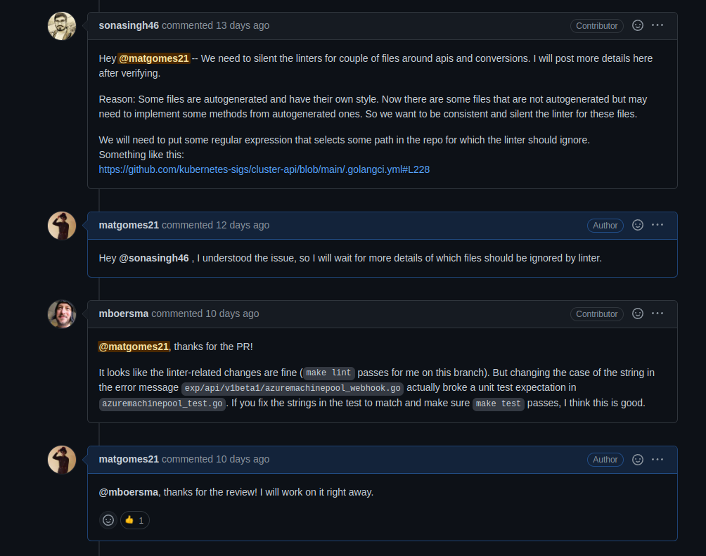
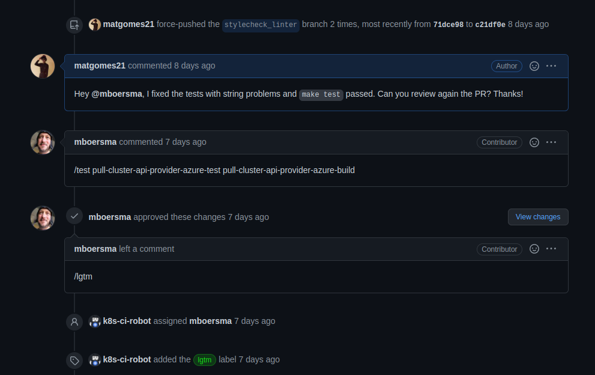
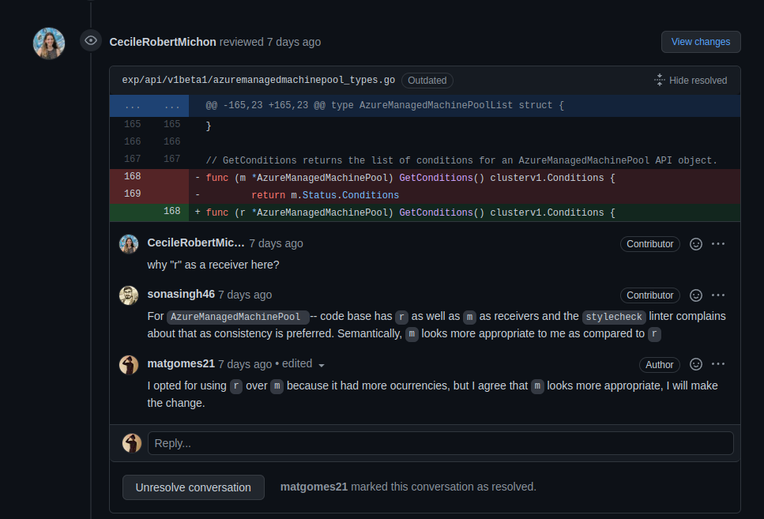
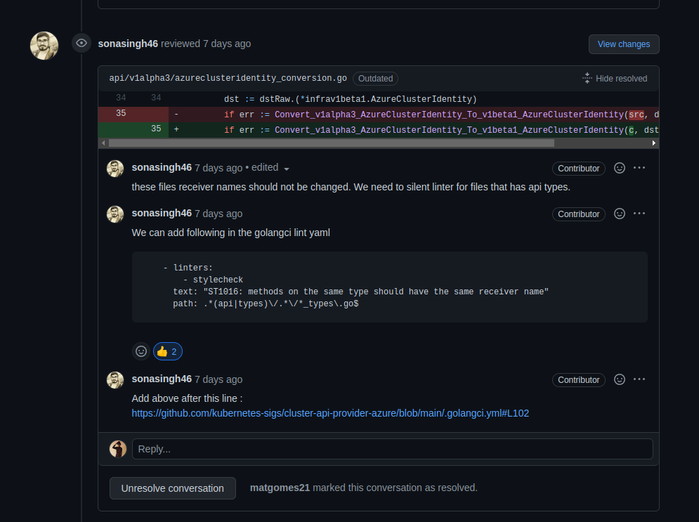
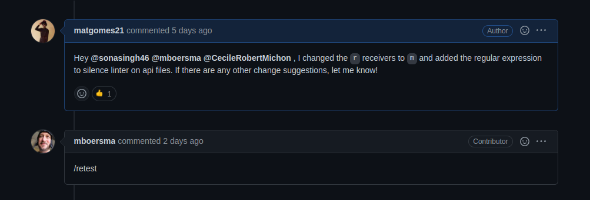

# Issue [#2030 Add stylecheck linter](https://github.com/kubernetes-sigs/cluster-api-provider-azure/issues/2030)

Após a abertura do primeiro PR, houveram mais discussões sobre essa issue, então foram feitas novas alterações e o PR foi atualizado.

|Página|Status|Responsável|
|:--:|:--:|:--:|
|Cluster Api Provider Azure|[PR Review requested](https://github.com/kubernetes-sigs/cluster-api-provider-azure/pull/2071)|Mateus Gomes|

## Discussão

As discussões feitas foram a respeito de silenciar o linter em alguns arquivos e trocar o nome de receivers.

## Histórico de Revisão
|Data|Versão|Descrição|Autor|
|:--:|:--:|:--:|:--:|
|24/02/22|0.1|Criação do documento|Mateus Gomes|