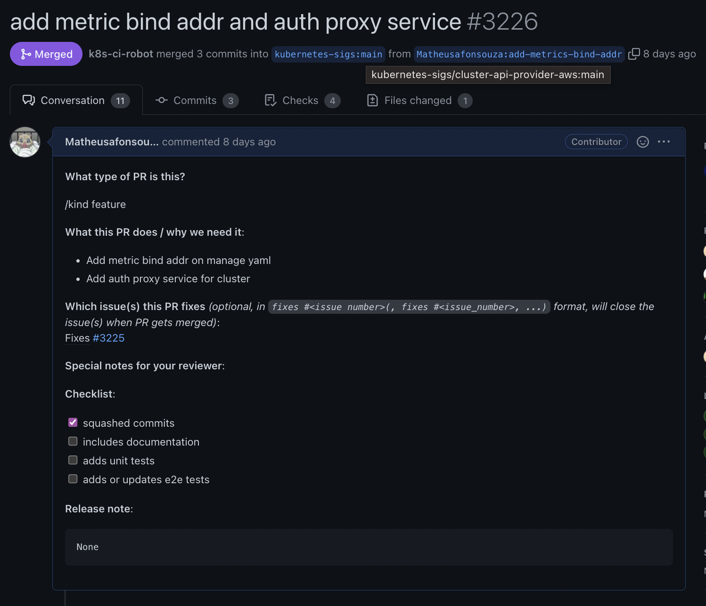
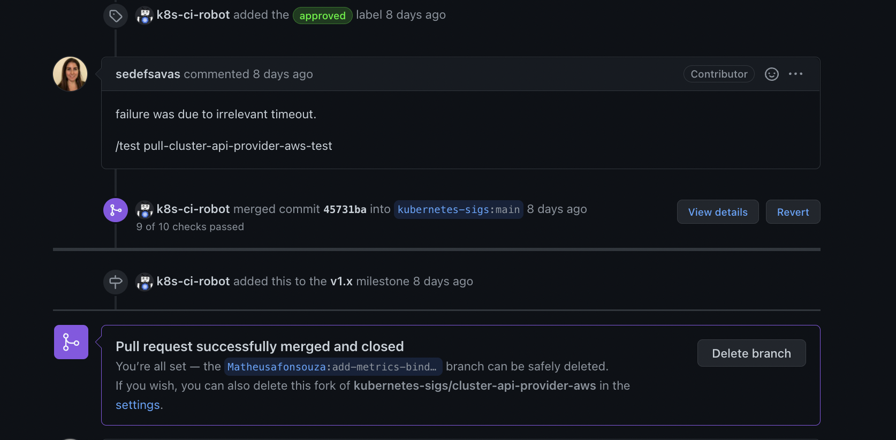

# Issue [#3225 Consider if to add --metrics-bind-addr=127.0.0.1:8080 in manager.yaml](https://github.com/kubernetes-sigs/cluster-api-provider-aws/issues/3225)

Applying this change is not mandatory, but FYI deploying Prometheus in local dev env using the CAPI Tiltfile won't work without this change.

A issue requisita que haja um bind do endereço de métricas para o manager do cluster aws kubernetes, assim, facilitando na conexão no serviço. Sem essa alteração o deploy do serviço de observabilidade Prometeus em ambiente de desenvolvimento não está se conectando com sucesso.

|Página|Status|Responsável|
|:--:|:--:|:--:|
|Cluster Api Provider Aws|[PR aprovado](https://github.com/kubernetes-sigs/cluster-api-provider-aws/issues/3225)|Matheus Afonso|

### Pull Request aberto

Após a contribuição, foi aberto um Pull Request

### Pull Request Aprovado

Após a revisão e comentários dos mantenedores o Pull Request foi aprovado e foi realizado o merge.

## Histórico de Revisão
|Data|Versão|Descrição|Autor|
|:--:|:--:|:--:|:--:|
|24/02/22|0.1|Criação do documento acerca do PR aprovado|Matheus Afonso|