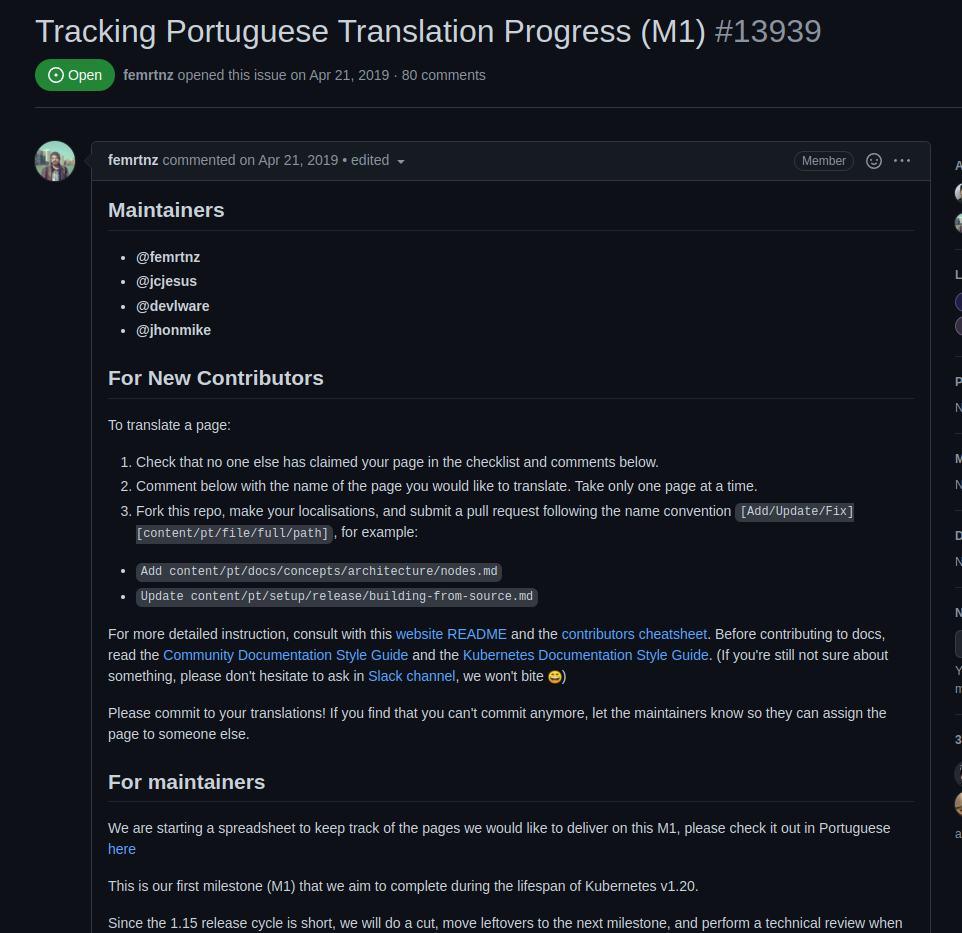
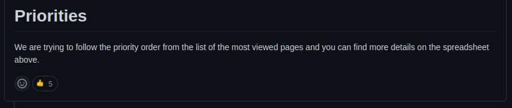
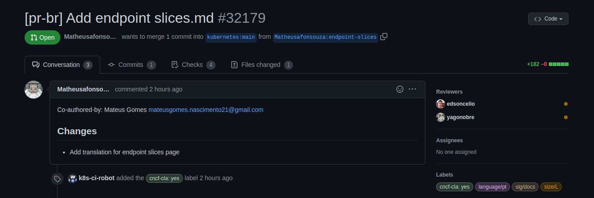

# Issue [#13939 Tracking Portuguese Translation Progress (M1)](https://github.com/kubernetes/website/issues/13939)

A issue 13939 é uma issue voltada para o rastreamento da tradução das páginas que envolvem a documentação referente ao kubernetes para português. A issue foi escolhida devido à importância de ter os documentos relacionados as funcionalidades do kubernetes em outros idiomas, principalmente se tratando em uma comunidade tão grande quanto a brasileira.

|     Página     |                              Status                               |           Responsável            |
| :------------: | :---------------------------------------------------------------: | :------------------------------: |
| Endpoint Slices | [PR Review requested](https://github.com/kubernetes/website/pull/32179) | Mateus Gomes e Matheus Afonso |
| Resouce Quotas | [PR Review requested](https://github.com/kubernetes/website/pull/32209) |Brenda Santos|

## Discussão da Issue ( Endpoint Slices )

### Pull Request aberto 

Após a contribuição, foi aberto um Pull Request:

## Discussão da Issue ( Resource Quotas )

### Pull Request aberto 

Após a contribuição, foi aberto um Pull Request:

## Histórico de Revisão

|   Data   | Versão |      Descrição       |      Autor       |
| :------: | :----: | :------------------: | :--------------: |
| 10/03/22 |  0.1   | Criação do documento | Mateus Gomes e Matheus Afonso |
| 21/03/22 |  0.2   | Adição de informações sobre a página de Resource Quotas | Brenda Santos |
