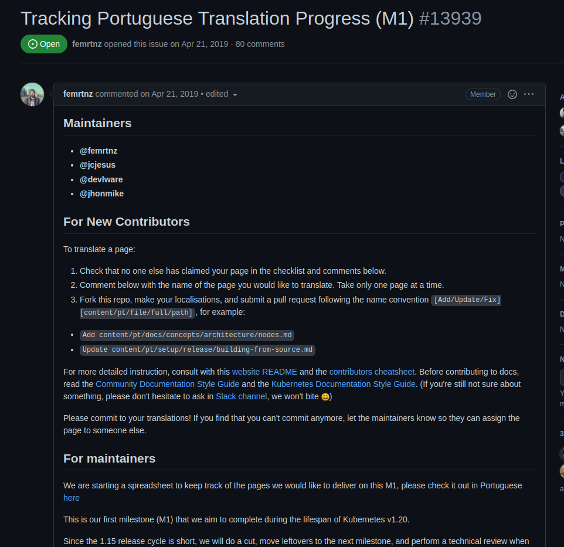
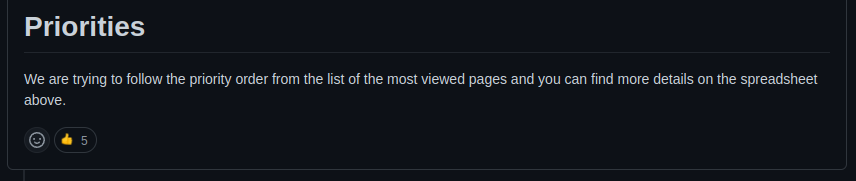

# Issue [#13939 Tracking Portuguese Translation Progress (M1) - Endpoint Slices Page](https://github.com/kubernetes/website/issues/13939)

A issue 13939 é uma issue mãe para as traduções das páginas do Kubernets para português do Brasil, e a partir dela, foi avisado que a página de Endpoint Slices seria traduzida. A issue foi escolhida devido à falta de issues de código disponíveis e também para variar os tipos de issues feitas pelos membros desta issue.

|     Página     |                              Status                               |           Responsável            |
| :------------: | :---------------------------------------------------------------: | :------------------------------: |
| Endpoint Slices | [PR Review requested](https://github.com/kubernetes/website/pull/32179) | Mateus Gomes e Matheus Afonso |

## Discussão da Issue

### Pull Request aberto

Após a contribuição, foi aberto um Pull Request

## Histórico de Revisão

|   Data   | Versão |      Descrição       |      Autor       |
| :------: | :----: | :------------------: | :--------------: |
| 10/03/22 |  0.1   | Criação do documento | Mateus Gomes e Matheus Afonso |
