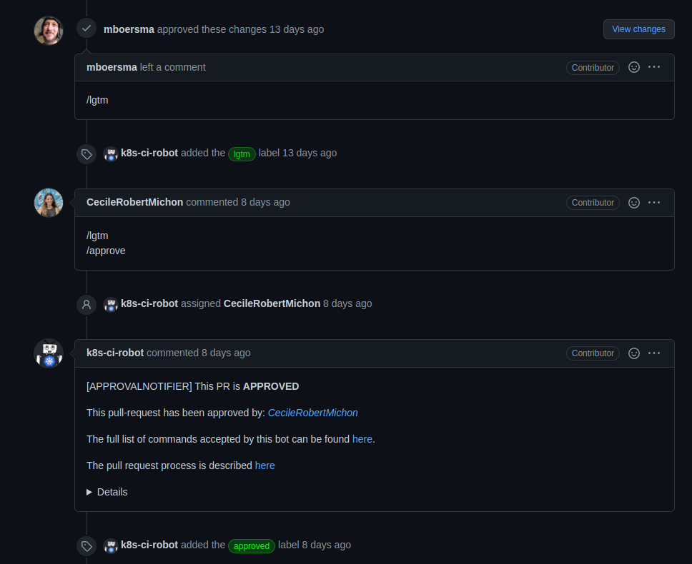
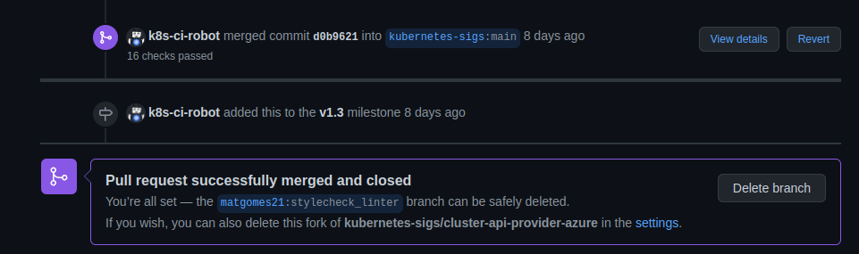

# Issue [#2030 Add stylecheck linter](https://github.com/kubernetes-sigs/cluster-api-provider-azure/issues/2030)

Após as alterações solicitadas pelos mantenedores, o PR dessa issue foi aprovado e foi feito o merge para o projeto.

|Página|Status|Responsável|
|:--:|:--:|:--:|
|Cluster Api Provider Azure|[PR aprovado](https://github.com/kubernetes-sigs/cluster-api-provider-azure/pull/2071)|Mateus Gomes|

## Prints

### Pull Request

Pull request revisado e aprovado.

## Histórico de Revisão
|Data|Versão|Descrição|Autor|
|:--:|:--:|:--:|:--:|
|10/03/22|0.1|Criação do documento|Mateus Gomes|