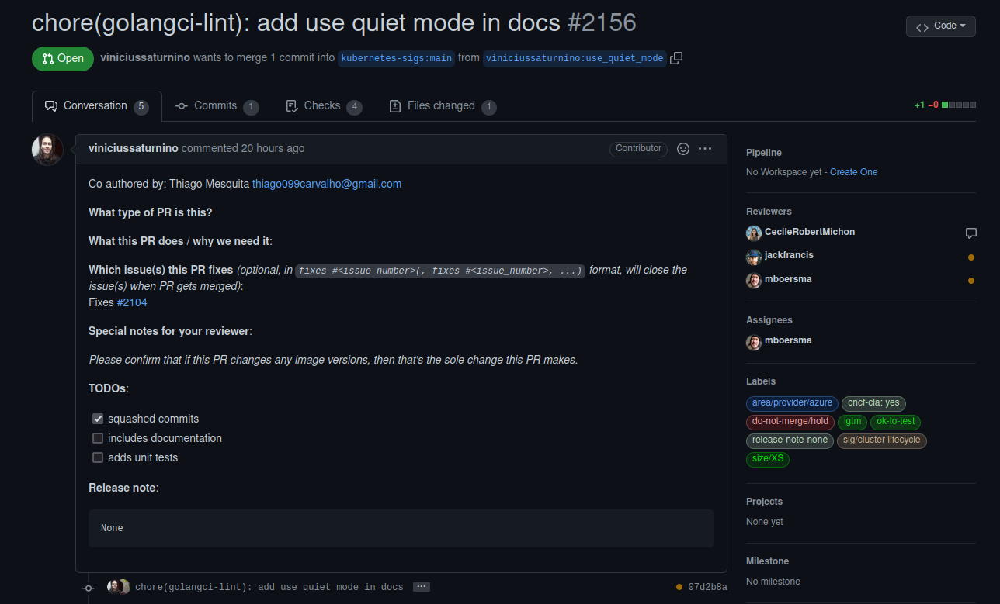

# Issue [#2104 Use quiet mode in docs link checker action](https://github.com/kubernetes-sigs/cluster-api-provider-azure/issues/2104)

A issue 2104 é uma issue voltada para a configuração do link-checker contido no lint-docs. A configuração em questão é a adição da configuração do step use quiet mode dentro do job markdown-link-check, com a finalidade de exibir os erros de links quebrados no markdown apenas no output, para facilitar a leitura e a identificação de links quebrados no documento.

|Página|Status|Responsável|
|:--:|:--:|:--:|
|Cluster Api Provider Azure|[PR em revisão](https://github.com/kubernetes-sigs/cluster-api-provider-azure/pull/2156)|Vinicius Saturnino e Thiago Mesquita|

## Discussão da Issue

### Pull Request aberto

Após a contribuição, foi aberto um Pull Request

### Pull Request Aprovado

## Histórico de Revisão
|Data|Versão|Descrição|Autor|
|:--:|:--:|:--:|:--:|
|24/02/22|0.1|Criação do documento acerca do PR aprovado|Thiago Mesquita e Vinícius Saturnino|