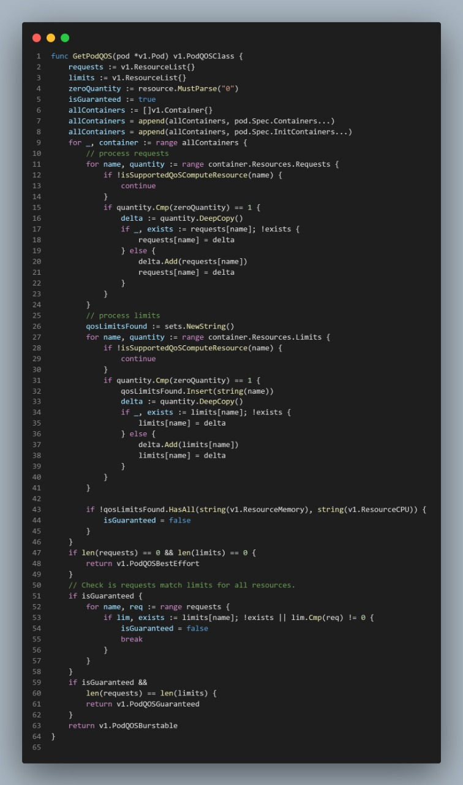
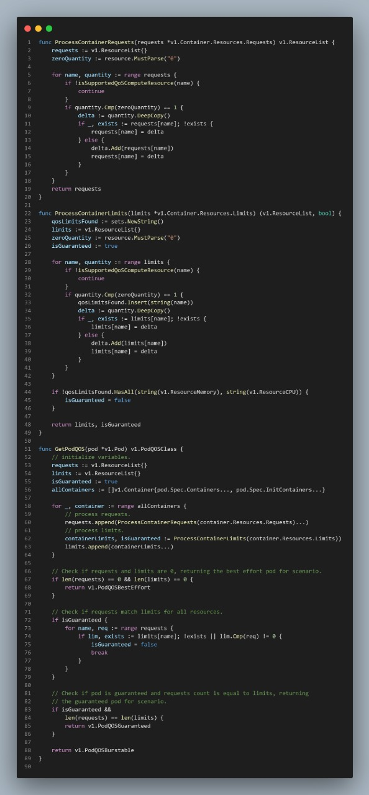

# Proposta de Melhoria no Repositório [kubetnets-sigs/descheduler](https://github.com/kubernetes-sigs/descheduler)


Para procurar possíveis pontos de melhorias que poderiam ser feitos utilizando conceitos de Clean Code e SOLID nos repositórios do Kubernetes, foi utilizada a ferramenta [Go Report Card](https://goreportcard.com/), que analisa algumas métricas de qualidade em projetos que utilizam a linguagem Go.

A partir do resultado desta ferramenta, os alunos Mateus Gomes e Matheus Afonso identificaram um bom ponto de melhoria no repositório [descheduler](https://github.com/kubernetes-sigs/descheduler), relacionado com a métrica ```gocycle```, que analisa a complexidade de um trecho do código.

O arquivo escolhido para a melhoria foi o ```pkg/utils/qos.go```, no qual está com a complexidade ciclomática de ```19```, ultrapassando o limite de ```15```, como pode ser visto na imagem abaixo.


## Solução

Analisando o trecho do código apontado pela ferramenta, é possível visualizar que a função ```GetPodQOS``` fere o princípio da responsabilidade única, pois ela possui diversas responsabilidades que poderiam estar divididas em outros módulos, melhorando a legibilidade do código e contribuíndo com o primeiro princípio do SOLID, o _Single Reponsibility Principle_, que trata justamente da especialização das classes.

Visando este princípio, foi feita uma refatoração nesta função, criando outras funções especialistas, para que cada função possua apenas uma responsabilidade dentro do software. Além disso, foram adicionados mais comentários no código para melhorar o entendimento do mesmo.

O código original e o código refatorado podem ser visualizados abaixo.

### Código Original



### Código Refatorado



## Histórico de Revisão
|Data|Versão|Descrição|Autor|
|:--:|:--:|:--:|:--:|
|07/04/22|0.1|Criação do documento|Mateus Gomes|