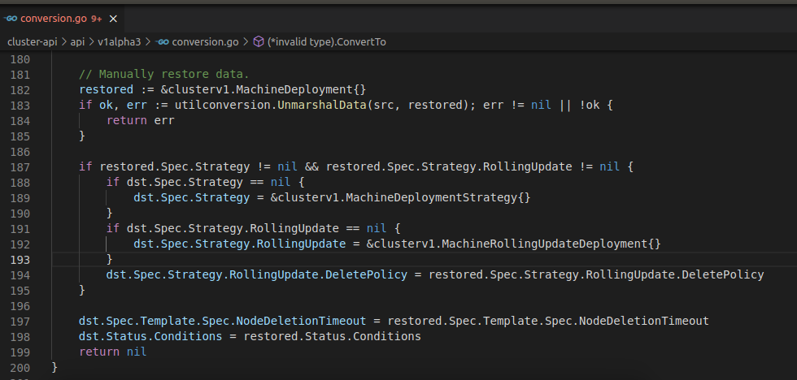
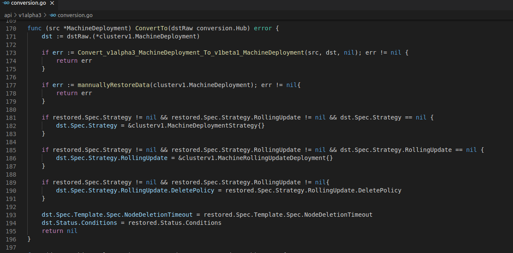
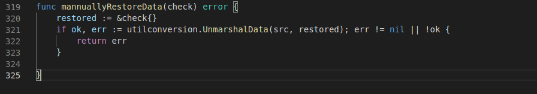
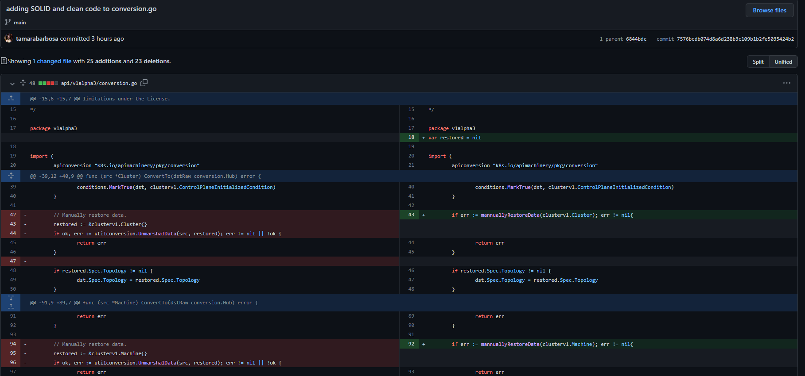

# Proposta de Melhoria no Repositório [cluster-api](https://github.com/tamarabarbosa/cluster-api)

 Após verificar os conceitos de clean code e SOLID verifiquei os repositórios do kubernetes uma função que se enquadraria nos temas estudados, encontrei um arquivo de difícil entendimento e que poderia receber os conceitos abordados, não foi utilizada ferramenta para essa verificação. O arquivo em questão trazia um comentário repetido para restauração manual de dados, pois se trata de conversão de dados, aparentemente remover o comentário seria uma boa opção mas para isso a operação que se encontrava abaixo foi movida para uma função com nome sugestivo e então retirado o comentário. Também verifiquei uma função com um if dentro de outro, o que resulta no aumento da complexidade e, para esta caso foi proposto que ultilizasse um if a mais mas ao invés de ifs encadeados. Abaixo é possível verificar essas alterações:

## Função Original

## Proposta de melhoria

## Commit

## Histórico de Revisão
|Data|Versão|Descrição|Autor|
|:--:|:--:|:--:|:--:|
|26/04/22|0.1|Criação do documento|Tâmara Barbosa|
