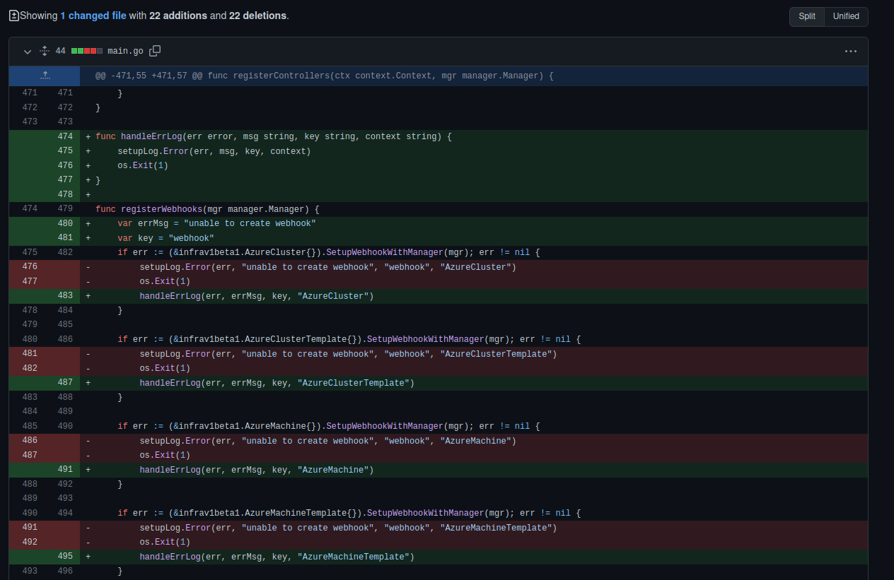

# Proposta de Melhoria no Repositório [cluster-api-provider-azure](https://github.com/kubernetes-sigs/cluster-api-provider-azure)

No repositório [cluster-api-provider-azure](https://github.com/kubernetes-sigs/cluster-api-provider-azure), utilizando a ferramenta [Go Report Card](https://goreportcard.com/), foi feita uma análise de alguns dos repositórios do Kubernetes e desta forma foi identificado uma função que poderia ser refatorada para diminuir a complexidade, além de ficar com melhor legibilidade e melhorar a manutenabilidade do código. A função e a proposta de melhoria estão a seguir:

## Função Original

## Proposta de melhoria

## Histórico de Revisão
|Data|Versão|Descrição|Autor|
|:--:|:--:|:--:|:--:|
|07/04/22|0.1|Criação do documento|Thiago Mesquita|