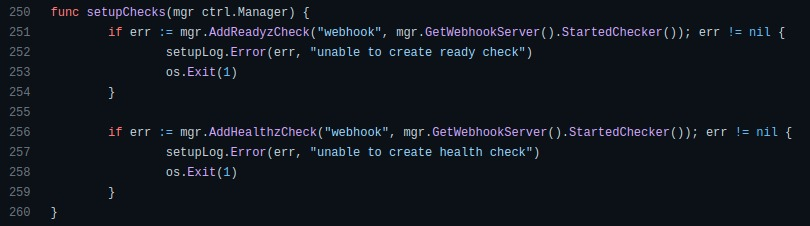
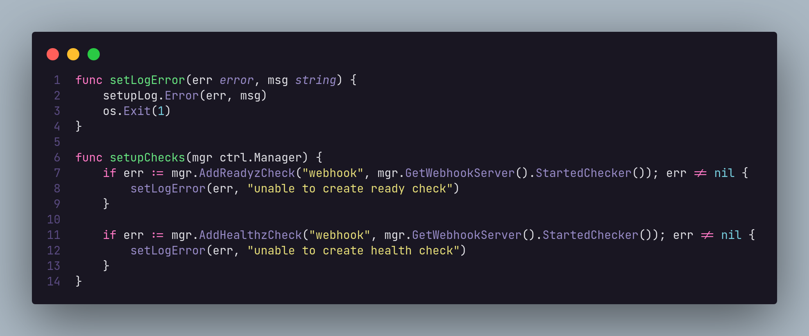
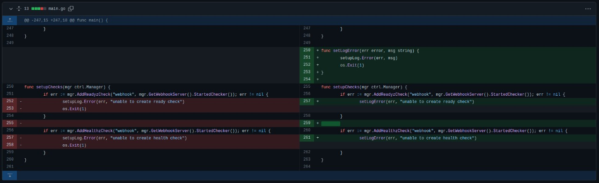

# Proposta de Melhoria no Repositório [cluster-api](https://github.com/kubernetes-sigs/cluster-api)

No repositório [cluster-api](https://github.com/kubernetes-sigs/cluster-api) foi identificado uma função que poderia ser refatorada para ficar com melhor legibilidade e melhorar a manutenabilidade do código. A função e a proposta de melhoria estão a seguir:

## Função Original

## Proposta de melhoria

## Histórico de Revisão
|Data|Versão|Descrição|Autor|
|:--:|:--:|:--:|:--:|
|06/04/22|0.1|Criação do documento|Vinícius Saturnino|