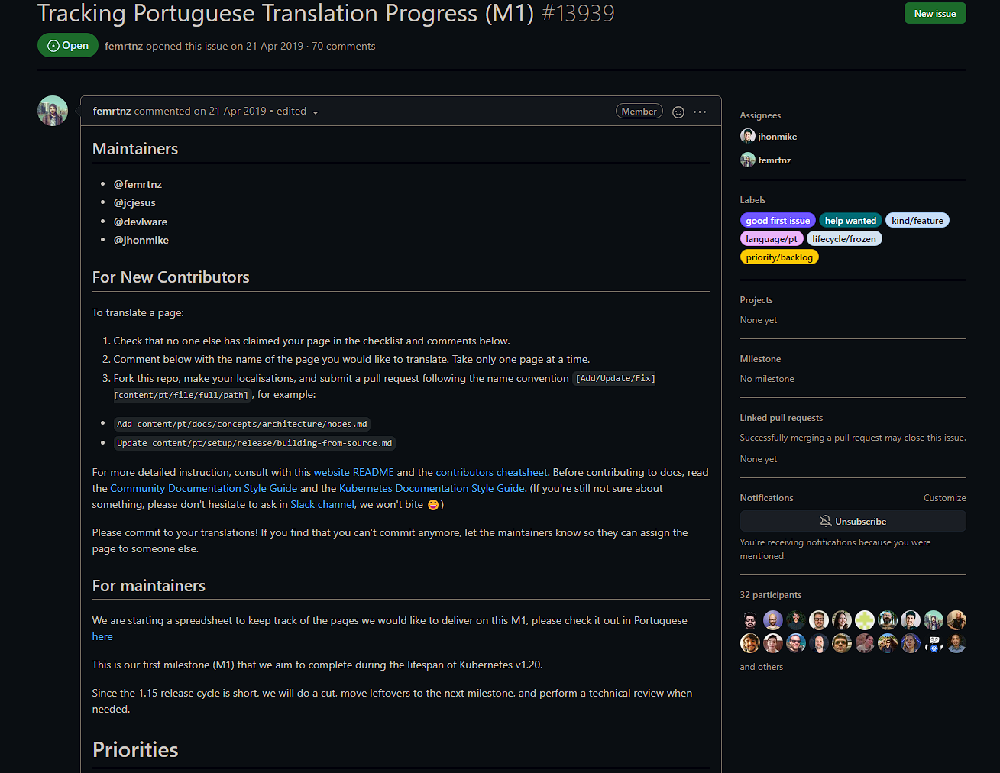
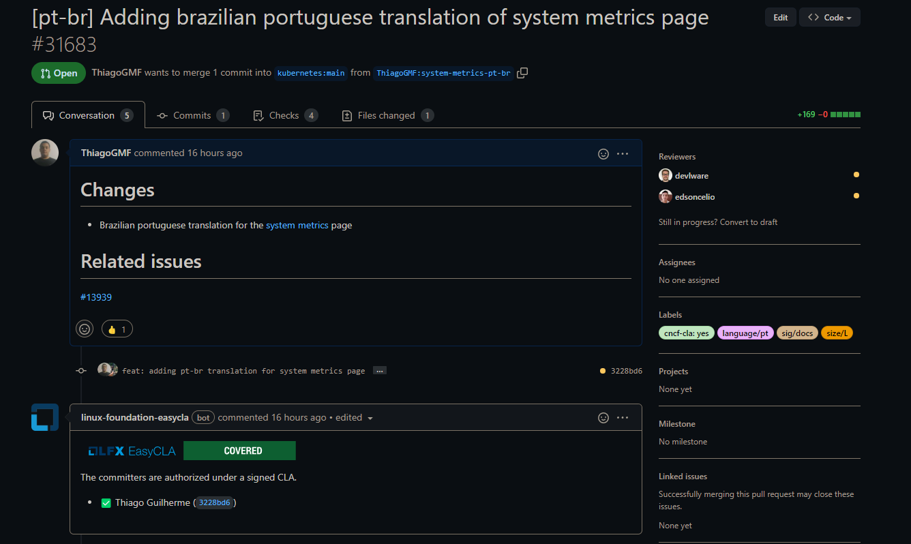
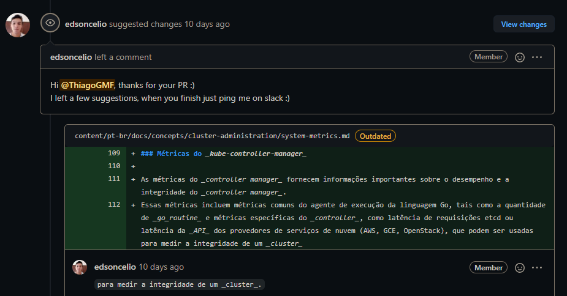
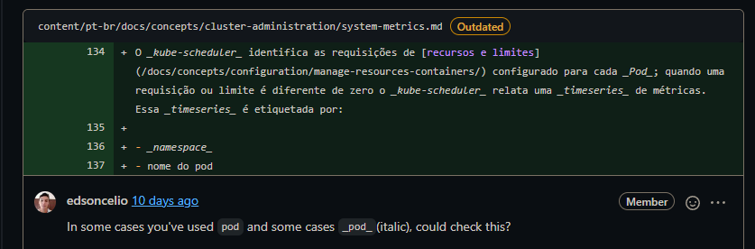
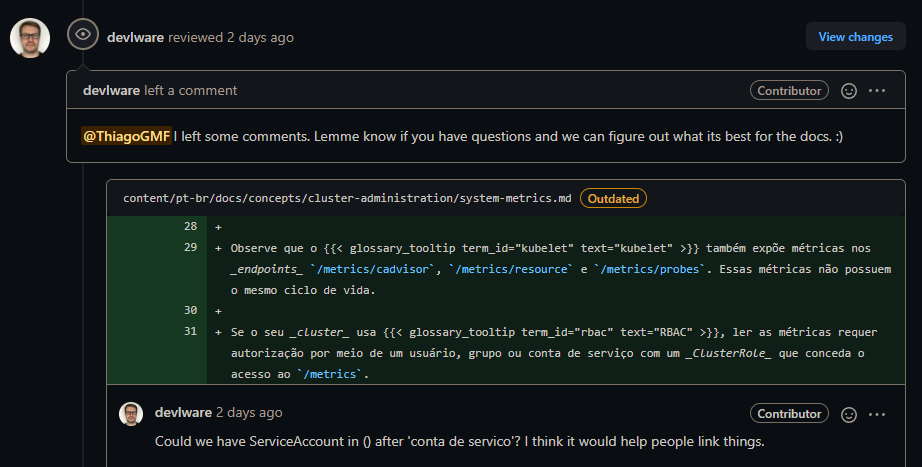
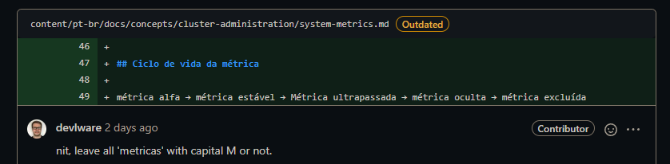

# Issue [#13939 Tracking Portuguese Translation Progress (M1)](https://github.com/kubernetes/website/issues/13939)

A issue 13939 é uma issue voltada para o rastreamento da tradução das páginas que envolvem a documentação referente ao kubernetes para português. A issue foi escolhida devido à falta de maturidade com as tecnologias que envolvem o projeto.

|     Página     |                              Status                               |           Responsável            |
| :------------: | :---------------------------------------------------------------: | :------------------------------: |
| System metrics | [PR Fechado](https://github.com/kubernetes/website/pull/31683) | Thiago Guilherme e Brenda Santos |

## Discussão da Issue

### Pull Request aberto

Após a contribuição, foi aberto um Pull Request

### Requisições de alterações

Após verificação alguns dos mantenedores solicitaram modificações na tradução para que o PR pudesse ser aprovado.

### PR Aprovado

Após adicionar as modificações solicitadas o PR foi aceito e fechado.

## Histórico de Revisão

|   Data   | Versão |      Descrição       |      Autor       |
| :------: | :----: | :------------------: | :--------------: |
| 10/02/22 |  0.1   | Criação do documento | Thiago Guilherme |
| 23/02/22 |  0.2   | Adição da conclusão do PR | Thiago Guilherme |
