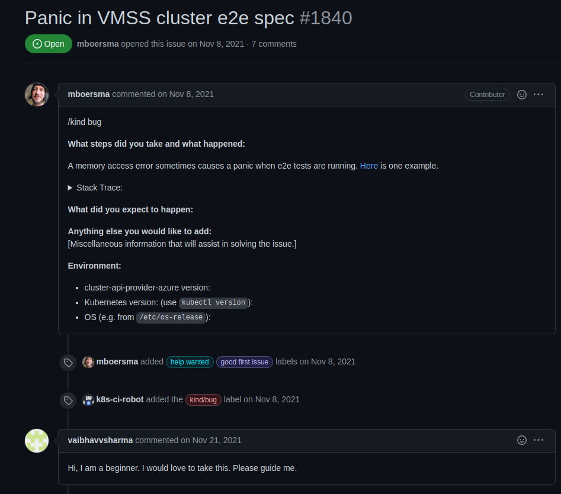
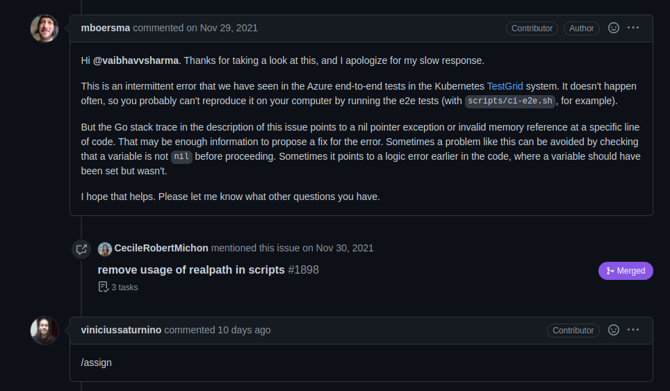
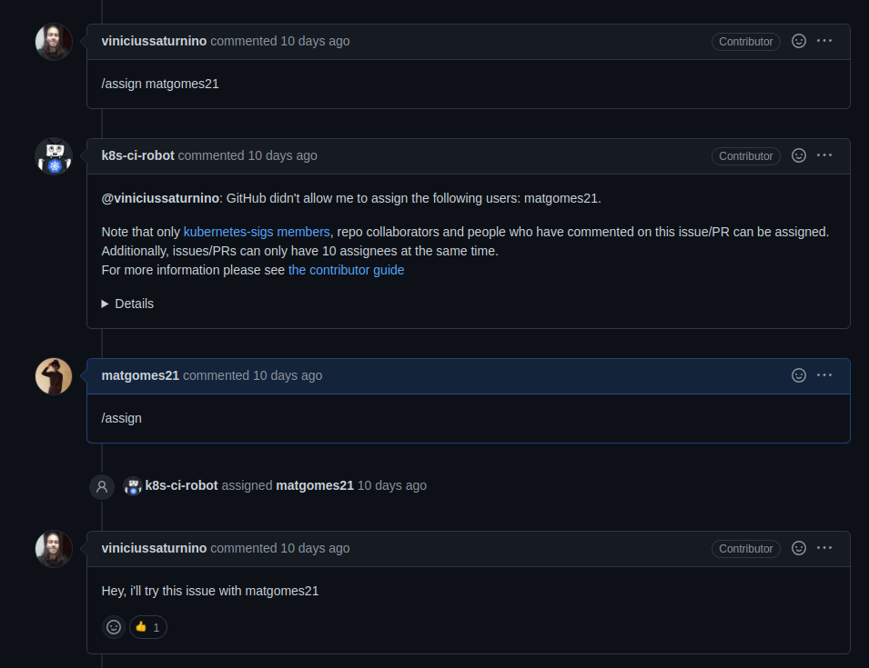

# Issue [#1840 Panic in VMSS cluster e2e spec](https://github.com/kubernetes-sigs/cluster-api-provider-azure/issues/1840)

A issue escolhida solicita a correção de um erro nos testes E2E da aplicação.

|Página|Status|Responsável|
|:--:|:--:|:--:|
|Cluster Api Provider Azure|PR não criado|Mateus Gomes e Vinícius Saturnino|

## Prints

### Issue

Issue criada e conversas dentro da thread.

## Histórico de Revisão
|Data|Versão|Descrição|Autor|
|:--:|:--:|:--:|:--:|
|24/02/22|0.1|Criação do documento|Mateus Gomes e Vinícius Saturnino|