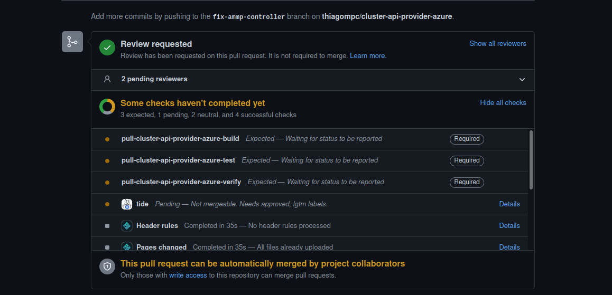
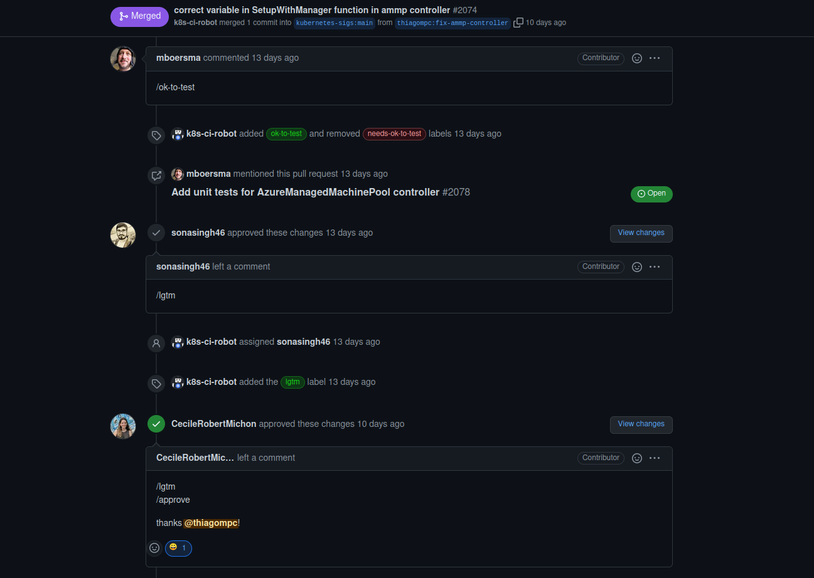
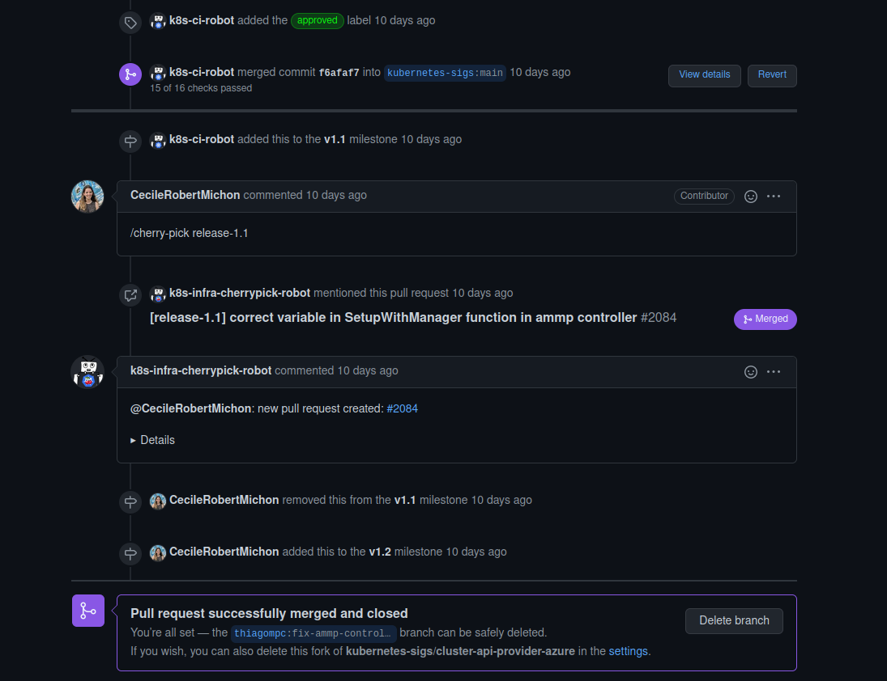

# Issue [#2058 AMMP controller watch event mapping function from CAPI machine pools using wrong GVK](https://github.com/kubernetes-sigs/cluster-api-provider-azure/issues/2058)

Após a discussão dentro da issue e após o commit, foi criado um Pull Request linkado à issue 2058 com a solução adequada. Com isso, foi necessário aguardar os comentários e a aprovação dos mantenedores do repositório. Após alguns dias o PR conseguiu a aprovação de todos os mantenedores necessários para a realização do merge.

|Página|Status|Responsável|
|:--:|:--:|:--:|
|Cluster Api Provider Azure|[PR aprovado](https://github.com/kubernetes-sigs/cluster-api-provider-azure/pull/2074)|Thiago Mesquita|

### Pull Request aberto

Após a contribuição, foi aberto um Pull Request

### Pull Request Aprovado

Após a revisão e comentários dos mantenedores o Pull Request foi aprovado e foi realizado o merge.

## Histórico de Revisão
|Data|Versão|Descrição|Autor|
|:--:|:--:|:--:|:--:|
|24/02/22|0.1|Criação do documento acerca do PR aprovado|Thiago Mesquita|