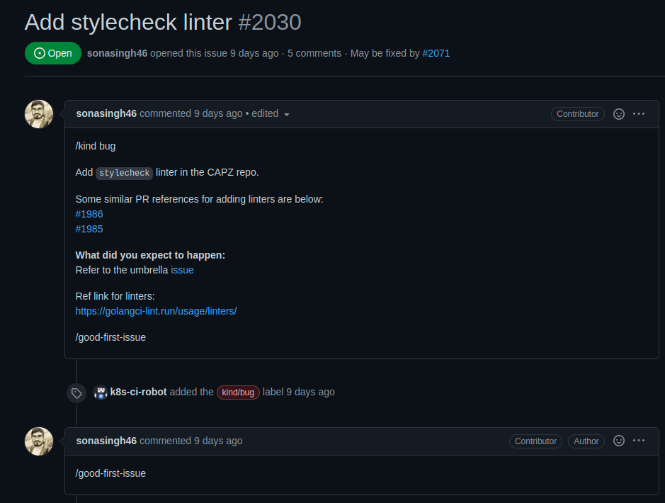
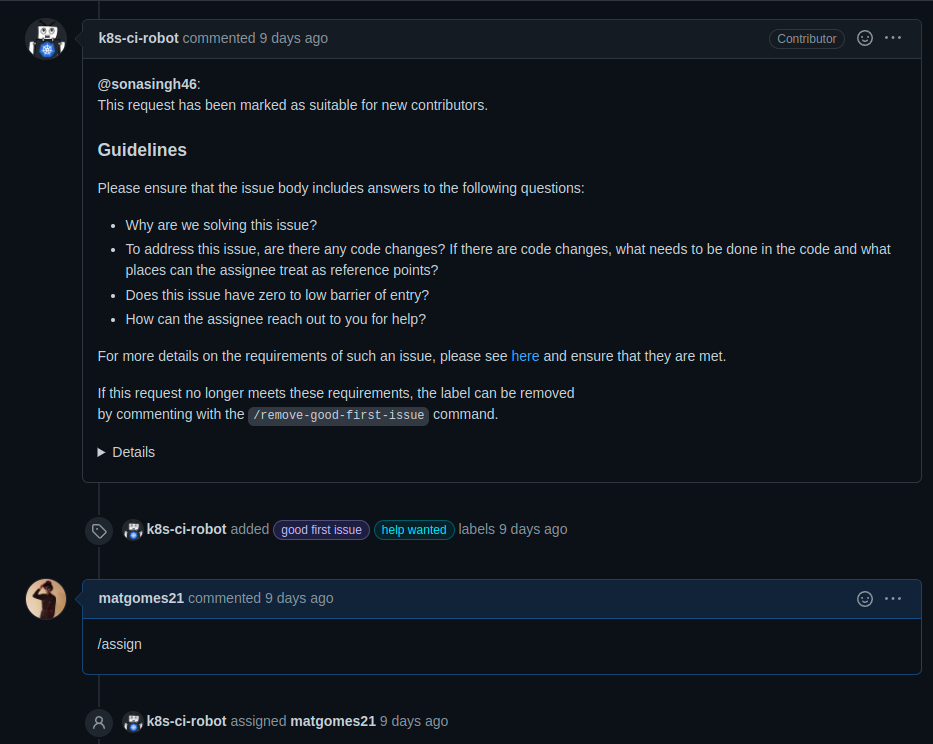
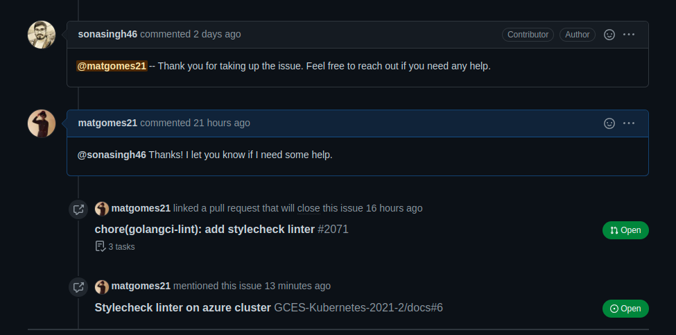
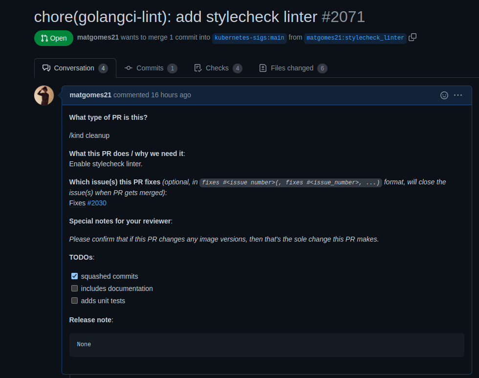
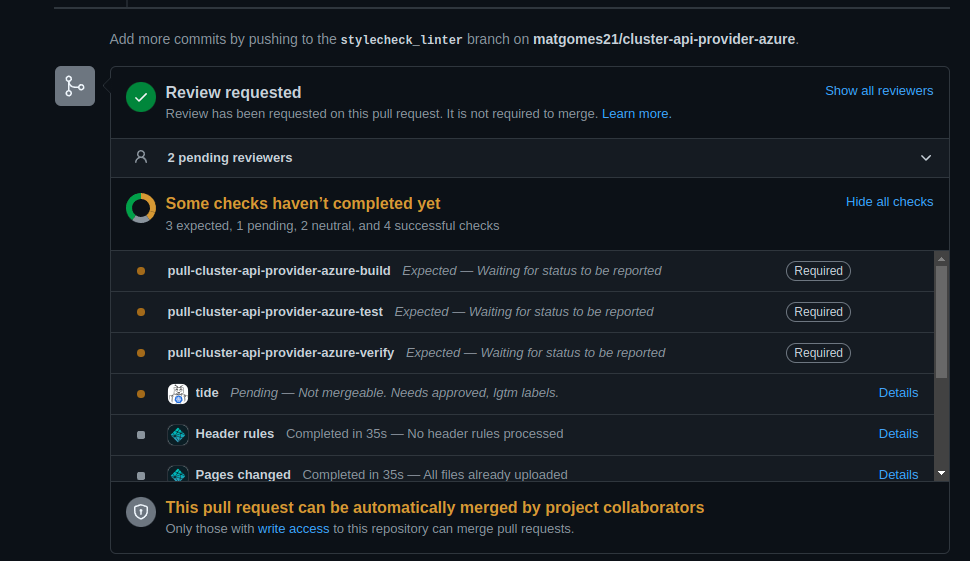

# Issue [#2030 Add stylecheck linter](https://github.com/kubernetes-sigs/cluster-api-provider-azure/issues/2030)

A issue escolhida solicita a inclusão de um linter dentro do projeto Cluster Api Provider Azure, ajudando na pardonização e qualidade do código. Desta forma, o linter **stylecheck** foi adicionado, e os erros apontados por ele foram corrigidos dentro do código.

|Página|Status|Responsável|
|:--:|:--:|:--:|
|Cluster Api Provider Azure|[PR em revisão](https://github.com/kubernetes-sigs/cluster-api-provider-azure/pull/2071)|Mateus Gomes|

## Prints

### Issue

Issue criada e conversas dentro da thread.

### Pull Request

Pull request aberto para análise.

## Histórico de Revisão
|Data|Versão|Descrição|Autor|
|:--:|:--:|:--:|:--:|
|10/02/22|0.1|Criação do documento|Mateus Gomes|