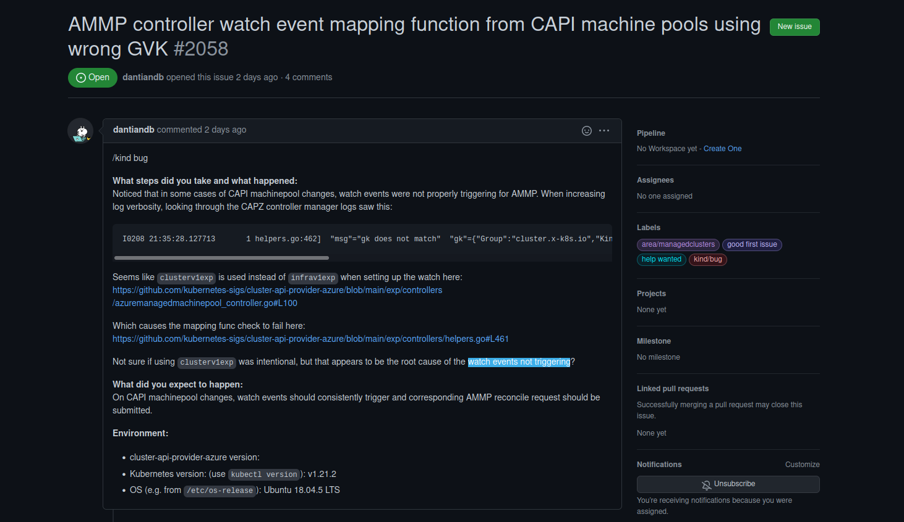
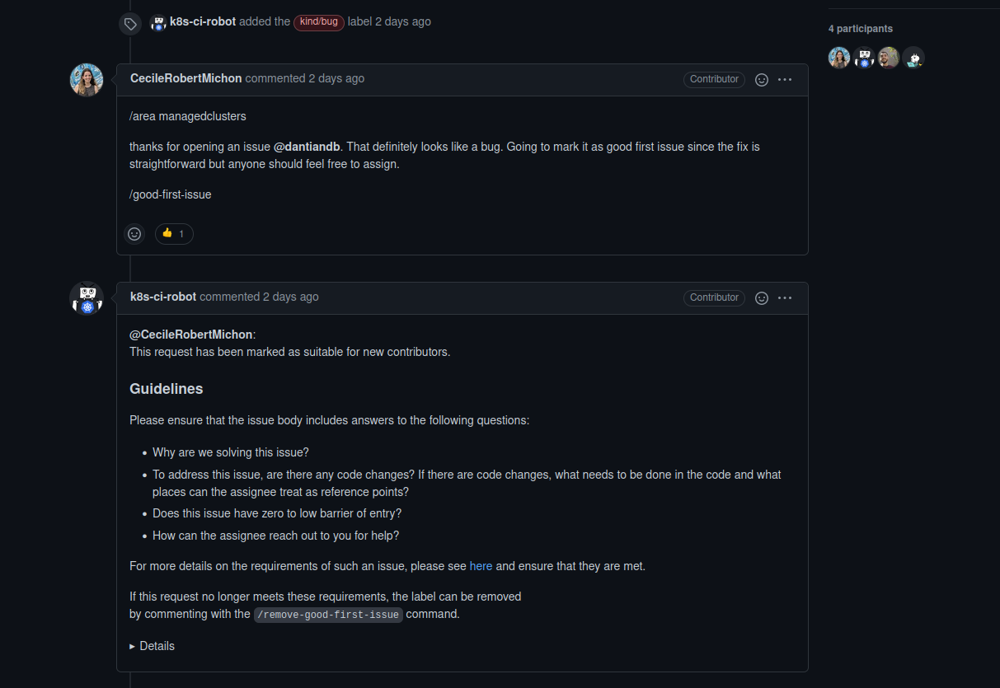
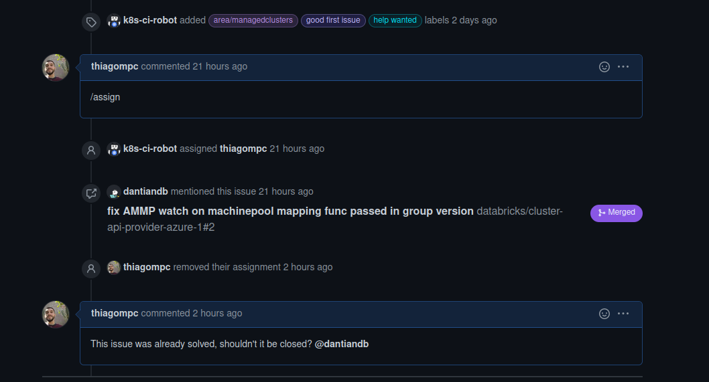

# Issue [#AMMP controller watch event mapping function from CAPI machine pools using wrong GVK](https://github.com/kubernetes-sigs/cluster-api-provider-azure/issues/2058)

A issue escolhida para execução foi uma issue de um bug onde o azure managed machine pool controller não executava os eventos monitorados por ele. Aparentemente o problema era a utilização de um package no setup da watch.

Quando li sobre a issue resolvi dar assign, e, durante a resolução, o próprio criador da issue, que não estava como assign, subiu a solução dele que foi aceita.

## Discussão da Issue

## Histórico de Revisão
|Data|Versão|Descrição|Autor|
|:--:|:--:|:--:|:--:|
|10/02/22|0.1|Criação do documento|Thiago Mesquita|