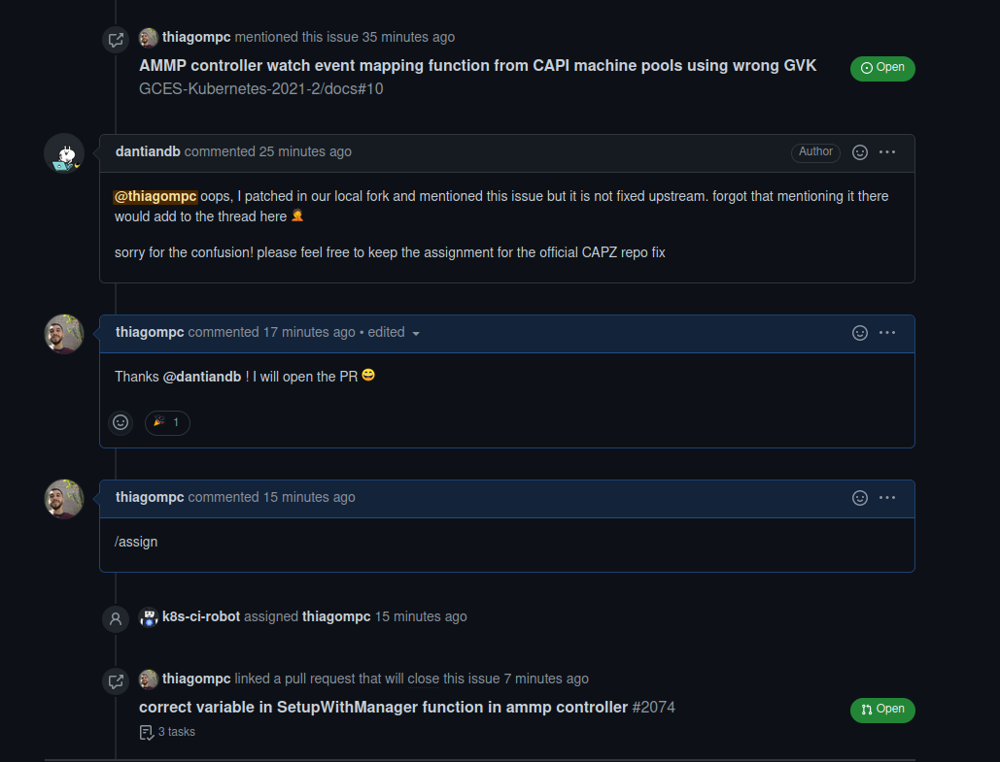
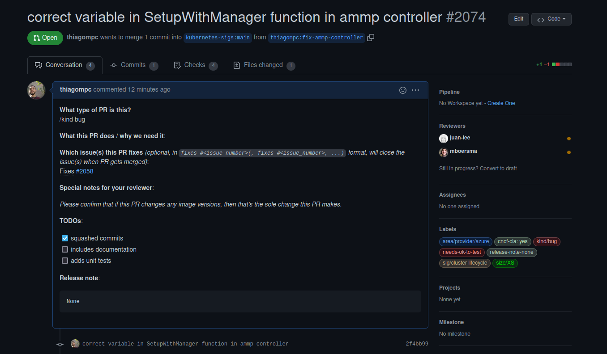

# Issue [#2058 AMMP controller watch event mapping function from CAPI machine pools using wrong GVK](https://github.com/kubernetes-sigs/cluster-api-provider-azure/issues/2058)

A issue escolhida para execução foi uma issue de um bug onde o azure managed machine pool controller não executava os eventos monitorados por ele. Aparentemente o problema era a utilização de um package no setup da watch. Assim, estudei o código e pude identificar a variável que estava causando o bug, corrigi e subi o PR.

|Página|Status|Responsável|
|:--:|:--:|:--:|
|Cluster Api Provider Azure|[PR em revisão](https://github.com/kubernetes-sigs/cluster-api-provider-azure/pull/2074)|Thiago Mesquita|

## Discussão da Issue

### Pull Request aberto

Após a contribuição, foi aberto um Pull Request

## Histórico de Revisão
|Data|Versão|Descrição|Autor|
|:--:|:--:|:--:|:--:|
|10/02/22|0.1|Criação do documento|Thiago Mesquita|
|10/02/22|0.2|Complementação do documento|Thiago Mesquita|