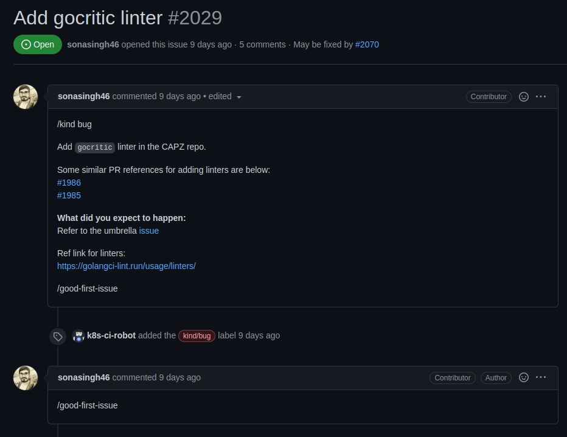
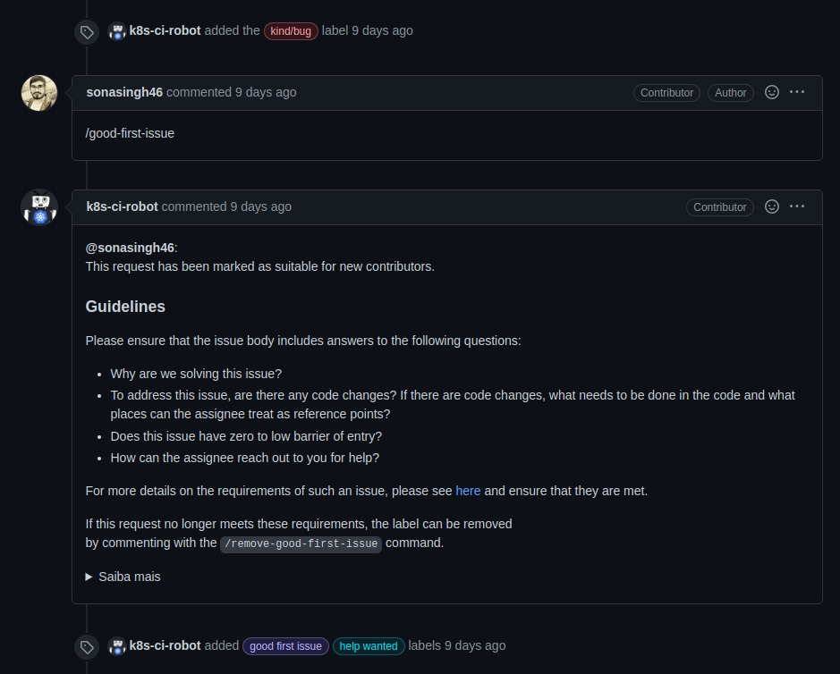
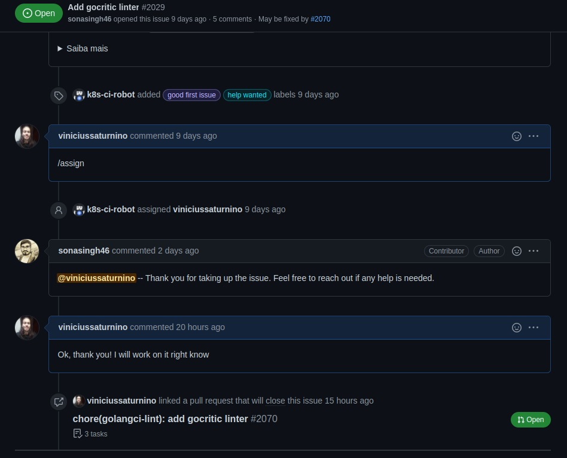
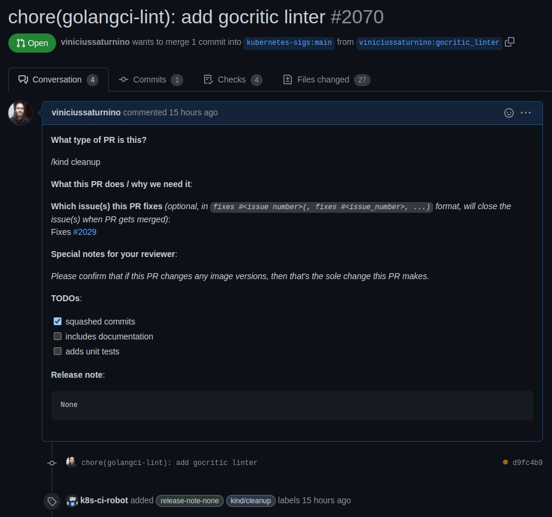
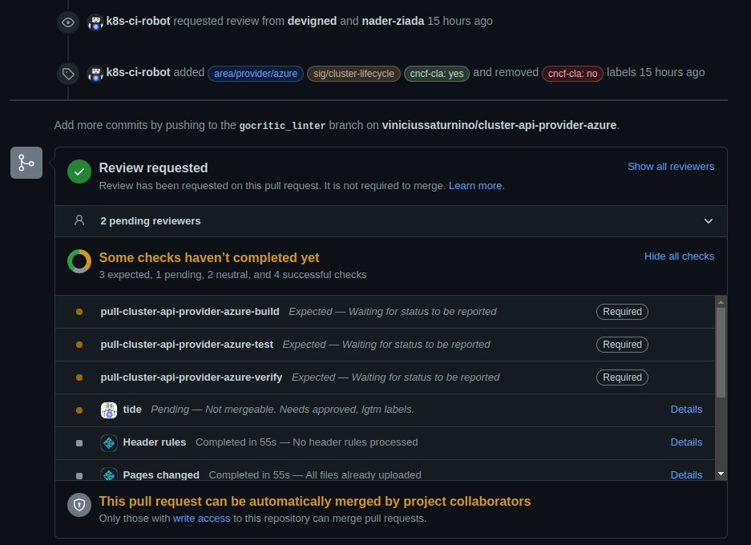
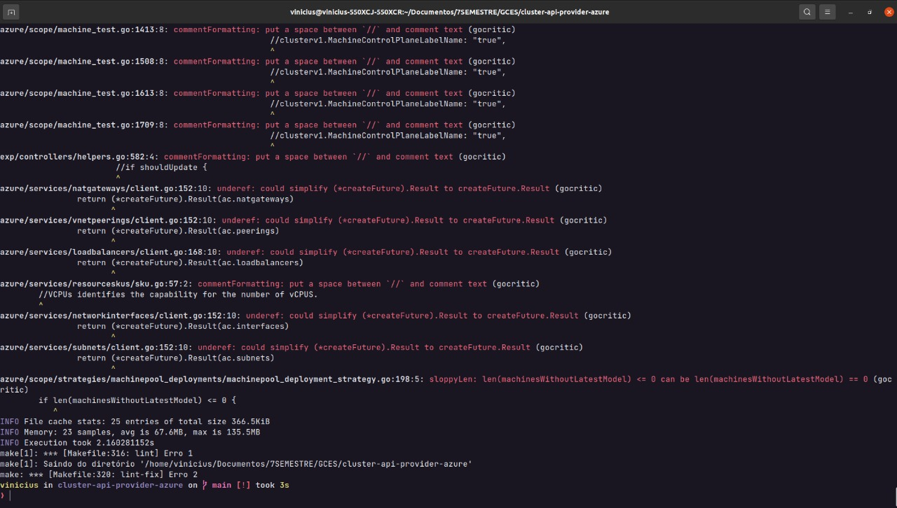
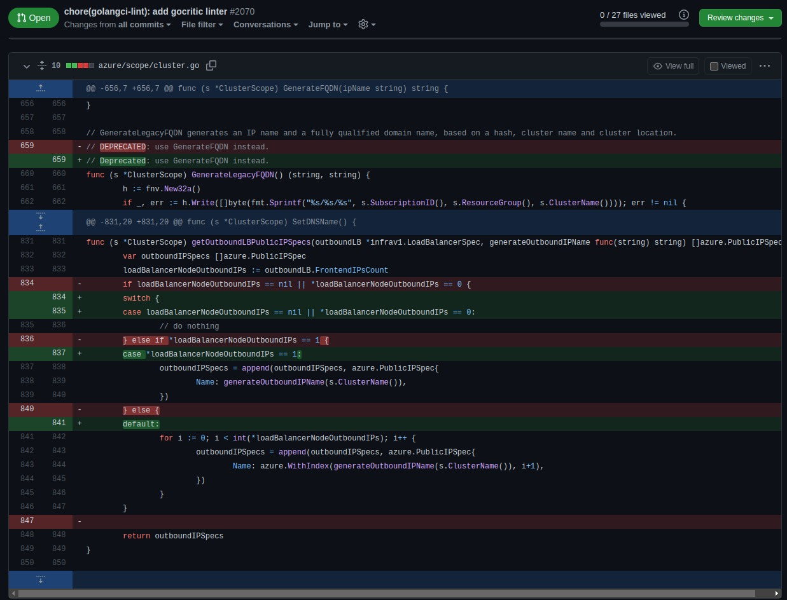

# Issue [#2070 gocritic linter](https://github.com/kubernetes-sigs/cluster-api-provider-azure/pull/2070)

A issue escolhida para execução foi uma issue ligada à padronização da qualidade do código através de linters, onde o mesmo realiza a validação e levantamento de erros relacionados à falta da qualidade do código. Assim, através dessa issue foi implementado o linter Gocritic dentro do repositório Cluster Api Provider Azure da organização.

|Página|Status|Responsável|
|:--:|:--:|:--:|
|Cluster Api Provider Azure|[PR em revisão](https://github.com/kubernetes-sigs/cluster-api-provider-azure/pull/2070)|Vinicius Saturnino|

## Prints

### Issue conversation

Issue aberta e conversas iniciais para inicio da contribuição

### Pull Request aberto

Após a contribuição, foi aberto um Pull Request onde houve a mudança de 27 arquivos

### Exemplo de mudança na contribuição

## Histórico de Revisão
|Data|Versão|Descrição|Autor|
|:--:|:--:|:--:|:--:|
|10/02/22|0.1|Criação do documento|Vinicius Saturnino|