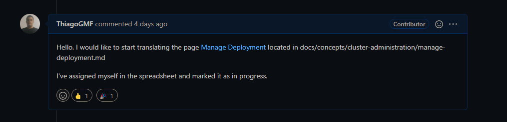
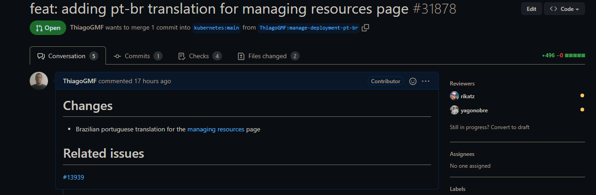

# Issue [#13939 Tracking Portuguese Translation Progress (M1)](https://github.com/kubernetes/website/issues/13939)

A issue 13939 é uma issue voltada para o rastreamento da tradução das páginas que envolvem a documentação referente ao kubernetes para português. A issue foi escolhida devido à importância de ter os documentos relacionados as funcionalidades do kubernetes em outros idiomas, principalmente se tratando em uma comunidade tão grande quanto a brasileira.

|      Página       |                            Status                             |   Responsável    |
| :---------------: | :-----------------------------------------------------------: | :--------------: |
| Managing Resource | [PR Aberto](https://github.com/kubernetes/website/pull/31878) | Thiago Guilherme |

## Discussão da Issue

### Pull Request aberto

Após a contribuição, foi aberto um Pull Request

## Histórico de Revisão

|   Data   | Versão |      Descrição       |      Autor       |
| :------: | :----: | :------------------: | :--------------: |
| 24/02/22 |  0.1   | Criação do documento | Thiago Guilherme |
